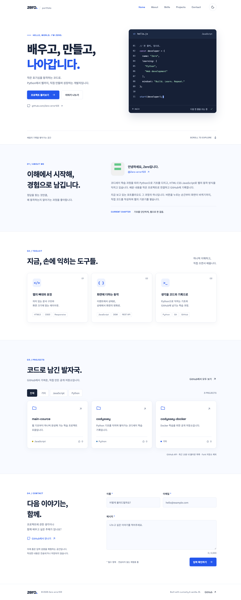
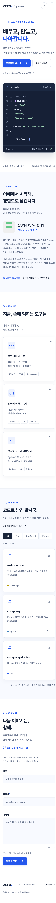
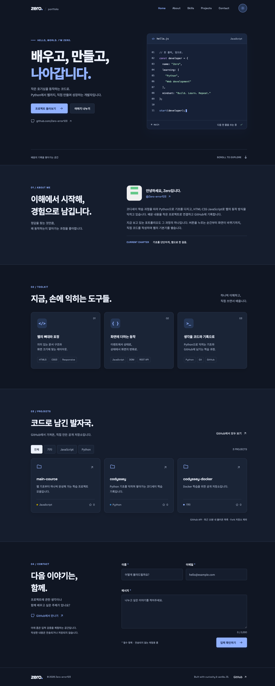

# Zero · 배우고, 만들고, 나아갑니다.

순수 HTML, CSS, JavaScript로 만든 반응형 개발 포트폴리오입니다. 코디세이 **AI/SW 기초 · 웹 기초와 프론트엔드** 과제로, 이벤트에서 상태 변경을 거쳐 화면이 바뀌는 흐름을 직접 구현했습니다.

- 공개 프로필: [Zero-error123](https://github.com/Zero-error123)
- 제출 저장소: [Zero-error123/main-cource](https://github.com/Zero-error123/main-cource)
- 배포 주소: [포트폴리오 열기](https://zero-error123.github.io/main-cource/)
- 현재 배포 상태: **배포 및 공개 사이트 검증 완료** (2026-09-23). [성공한 GitHub Actions 실행](https://github.com/Zero-error123/main-cource/actions/runs/35810175587)

## 실행

### VS Code + Live Server

1. VS Code에서 이 프로젝트 폴더 `B/1-1`을 엽니다.
2. **Live Server** 확장(`ritwickdey.LiveServer`)을 설치합니다. `.vscode/extensions.json`에도 추천 확장으로 등록했습니다.
3. `index.html`을 우클릭하고 **Open with Live Server**를 선택합니다.
4. 브라우저에서 `http://127.0.0.1:5500`으로 접속합니다. 파일을 저장하면 자동으로 새로고침됩니다.

5500번 포트가 이미 사용 중이면 기존 서버를 종료하거나 `.vscode/settings.json`의 포트를 바꿉니다.

설치 없이 확인하려면 저장소 루트에서 다음 명령도 사용할 수 있습니다. 이 서버는 자동 새로고침을 지원하지 않습니다.

```sh
python3 -m http.server 5500 --bind 127.0.0.1 --directory B/1-1
```

`file://`로 여는 대신 HTTP 서버를 이용합니다. 별도 빌드나 `npm install`은 필요 없습니다.

## 구조

```text
main-cource/
├── AGENTS.md                      # 여러 과제에 적용할 공통 작업 지침
├── .github/workflows/pages.yml    # B/1-1만 GitHub Pages에 배포
└── B/1-1/
    ├── index.html                # 시맨틱 마크업과 6개 섹션
    ├── css/style.css             # 모바일 퍼스트·테마·레이아웃
    ├── js/config.js              # GitHub 아이디와 동작 기준
    ├── js/app.js                 # 상태·이벤트·렌더링·API
    ├── images/
    │   ├── profile.png           # GitHub 공개 아바타
    │   ├── favicon.svg
    │   └── screenshots/          # 데스크톱·모바일·다크 모드
    ├── .vscode/                  # Live Server 설정과 추천 확장
    ├── .nojekyll
    ├── AGENTS.md                 # 이 과제의 제약 사항
    ├── VERIFICATION.md           # 실제 검증 결과
    └── README.md
```

## 구현 기능

| 영역 | 구현 내용 |
| --- | --- |
| 페이지 구성 | Hero, About, Skills, Projects, Contact, Footer |
| 반응형 | 모바일 기본, 768px 태블릿, 1024px 데스크톱 |
| 메뉴 | 햄버거 토글, 링크 선택·바깥 클릭·Escape·포커스 이탈 시 닫기 |
| 스크롤 | 부드러운 앵커 이동, 현재 섹션 표시, 맨 위로 이동 |
| 테마 | 다크/라이트 전환, `localStorage` 저장, 시스템 테마 감지 |
| 애니메이션 | Intersection Observer 등장 효과, 모션 감소 설정 존중 |
| GitHub | `fetch` + `async/await`, 로딩·성공·오류·빈 상태, 재시도 |
| 프로젝트 필터 | `map`으로 버튼과 카드 생성, `filter`로 언어별 목록 표시 |
| 문의 폼 | 이름·이메일·메시지 검증, 필드별 오류, 첫 오류로 포커스, 성공 안내 |
| 접근성 | 본문 바로가기, 명시적 label, 의미 있는 alt, 키보드 포커스, ARIA 상태 |

프레임워크와 런타임 라이브러리를 사용하지 않습니다. Google Fonts의 Noto Sans KR·Space Grotesk만 사용하며, 폰트를 불러오지 못해도 시스템 폰트로 표시됩니다. 아이콘은 직접 포함한 SVG입니다.

## 이벤트 → 상태 → 렌더링

`app.js`의 `state`가 화면을 결정합니다. 이벤트 핸들러는 상태를 바꾸고, `render…()` 함수는 그 상태를 읽어 DOM을 갱신합니다.

| 사용자 동작 / 이벤트 | 변경되는 상태 | 화면 업데이트 |
| --- | --- | --- |
| 테마 버튼 `click` | `state.theme` | `renderTheme()` → `data-theme`, 아이콘, 버튼 설명 |
| 메뉴 버튼 `click` | `state.menuOpen` | `renderMenu()` → `classList.toggle('active')`, `aria-expanded` |
| API 호출·응답 | `state.projects.status` | `renderProjects()` → 로딩 / 카드 / 오류 / 빈 목록 |
| 언어 필터 `click` | `state.projects.filter` | `filter()`로 선택 → `map()`으로 카드 생성 |
| 폼 `input`·`submit` | `state.form.values/errors/successful` | `renderForm()` → 오류 텍스트, `aria-invalid`, 성공 안내 |
| 페이지 `scroll` | 헤더·탑 버튼·현재 섹션 상태 | `renderScroll()` → 클래스, 표시 여부, 현재 메뉴 |

React에서 상태가 바뀌면 컴포넌트가 다시 렌더링되는 흐름을, 여기서는 DOM API로 직접 구현한 것입니다.

### 주요 개념 설명

- **시맨틱 HTML:** `header`와 `nav`는 페이지 안내, `main`은 핵심 내용, `section`은 제목이 있는 주제, `article`은 독립적으로 읽을 수 있는 기술·프로젝트 카드, `footer`는 저작권과 외부 링크를 담습니다. `div`와 `span`은 별도 문서 의미가 없는 배치·표현에 사용합니다.
- **Flexbox와 Grid:** 한 줄을 중심으로 로고·메뉴·버튼을 배치하는 네비게이션에는 Flexbox를 사용합니다. 행과 열에 카드가 놓이는 Projects에는 `repeat(auto-fit, minmax(min(100%, 285px), 1fr))` Grid를 사용합니다. 안쪽 `min()`은 320px 화면에서도 최소 열 너비가 화면을 넘지 않게 합니다.
- **DOM과 이벤트:** `querySelector`로 하나의 요소를, `querySelectorAll`로 여러 요소를 선택하고 `addEventListener`로 동작을 연결합니다. 텍스트는 `textContent`, 카드 템플릿은 `innerHTML`, 표현 상태는 `classList`로 갱신합니다.
- **ES6+:** 화살표 함수로 콜백을 작성하고, 구조분해로 설정과 API 필드를 추출합니다. 템플릿 리터럴로 카드 HTML을 조립하고 `map`은 변환, `filter`는 선택, `forEach`는 요소별 처리를 담당합니다.
- **비동기:** `fetch` 시작 전에 로딩 상태로 전환합니다. `await` 이후 `response.ok`를 검사하고 정상 데이터는 성공 상태로, 예외는 `catch`에서 오류 상태로 전환합니다. `finally`에서 요청 타이머를 해제하고 결과를 렌더링합니다.

## 동작 기준과 저장

기준값은 [js/config.js](js/config.js)에서 바꿀 수 있습니다.

| 항목 | 값 |
| --- | --- |
| 헤더 배경 변화 | 스크롤 60px 이상 |
| 스크롤 탑 버튼 | 스크롤 300px 이상 |
| Observer threshold | 0.2 |
| API 타임아웃 | 12초 |
| API 캐시 | 10분, `sessionStorage` |
| 테마 저장 키 | `zero-portfolio-theme`, `localStorage` |
| 브레이크포인트 | 768px, 1024px |

처음 방문하면 `prefers-color-scheme`을 따릅니다. 사용자가 테마를 선택하면 저장한 설정을 우선합니다. 저장소 접근이 차단되어도 현재 페이지의 기능은 계속 동작합니다.

스크롤 처리는 `requestAnimationFrame`으로 묶어 한 프레임에 한 번만 수행합니다. 동적 버튼은 이벤트 위임을 사용하고, 관찰이 끝난 요소는 `unobserve`, 모든 관찰이 끝나면 `disconnect`합니다. 임시 포커스 이벤트는 같은 콜백을 재사용하며 한 번 실행되면 해제됩니다. 반복 동작 검증 수치는 [VERIFICATION.md](VERIFICATION.md)에 있습니다.

## GitHub API

```text
https://api.github.com/users/Zero-error123/repos?sort=updated&direction=desc&per_page=100&type=owner
```

- 최신 업데이트 순으로 최대 100개를 가져옵니다. 현재 계정 규모에서는 한 번의 요청으로 충분합니다.
- 공개 저장소 중 Fork·보관된 저장소를 제외합니다. 언어 정보가 없는 저장소는 `기타`로 표시합니다.
- 로딩 스피너, 카드 목록, `프로젝트를 불러올 수 없습니다`와 재시도 버튼, `표시할 프로젝트가 없습니다`를 각각 제공합니다.
- `403`·`429`는 요청 한도·접근 제한 안내, `404`는 계정 확인 안내, 네트워크 실패·타임아웃은 재시도 안내를 표시합니다.
- 인증 토큰과 쿠키를 보내지 않습니다. 비인증 요청 제한을 고려해 같은 탭의 새로고침은 10분 동안 캐시를 사용합니다. 재시도는 캐시를 건너뜁니다.
- 캐시는 저장소의 최소 공개 필드만 담습니다. API 실패 시 가짜 프로젝트를 대신 보여주지 않습니다.
- API 텍스트는 HTML 이스케이프 후 사용하고, 카드 링크는 고정된 GitHub 도메인과 저장소 이름으로 생성합니다.

참고: [GitHub 저장소 API](https://docs.github.com/en/rest/repos/repos#list-repositories-for-a-user), [API 호출 제한](https://docs.github.com/en/rest/using-the-rest-api/rate-limits-for-the-rest-api).

## 공개 정보와 문의 폼

소개는 [공개 GitHub 프로필](https://github.com/Zero-error123), [Python 학습 저장소](https://github.com/Zero-error123/codyssey), 이 과제의 실제 구현 내용을 바탕으로 작성했습니다. 실명, 실제 이메일, 전화번호, 상세 위치, 비공개 활동, 추측한 경력·소속은 포함하지 않습니다. 프로필 이미지는 GitHub에 공개된 아바타를 로컬 파일로 저장한 것입니다.

문의 폼은 **유효성 검증 체험용**입니다. 이름·메시지의 공백만 있는 입력을 거절하고, 이메일의 기본 형식을 확인합니다. `submit`에서 `event.preventDefault()`로 페이지 이동을 막습니다. 성공 안내는 검증이 끝났다는 뜻이며 실제 이메일 전송은 하지 않습니다. 입력 내용을 서버나 브라우저 저장소에 보관하지 않습니다. `hello@example.com`은 예시 주소입니다.

선택 과제 중 언어 필터와 시스템 테마 감지를 구현했습니다. 타이핑 효과와 실제 이메일 전송 서비스는 추가하지 않았습니다.

## GitHub Pages 배포

루트 [.github/workflows/pages.yml](../../.github/workflows/pages.yml)이 `B/1-1`의 변경을 감지해 사이트를 배포합니다. `B/1-1`을 결과물의 루트로 올리므로 주소에 `/B/1-1/`을 덧붙이지 않습니다. 다른 과제, README, 테스트 스크린샷, 로컬 설정 파일은 사이트 배포 대상에서 제외합니다.

1. `Zero-error123/main-cource`에 쓰기 권한이 있는 계정으로 커밋을 `main`에 push합니다.
2. 저장소 소유자가 **Settings → Pages → Build and deployment → Source → GitHub Actions**를 선택합니다.
3. **Actions → Deploy B/1-1 portfolio to GitHub Pages**에서 실행 결과를 확인합니다. 필요하면 **Run workflow**를 실행합니다.
4. 배포 성공 후 제공된 URL에서 반응형, 테마 유지, 프로젝트 조회, 폼 검증을 다시 확인합니다.

Pages 초기 설정에는 저장소 관리자 권한이 필요할 수 있습니다. 로컬에서 로그인한 계정은 `gh api user --jq .login`, 저장소 권한은 `gh api repos/Zero-error123/main-cource --jq .permissions`로 확인할 수 있습니다.

공식 안내: [GitHub Pages 게시 소스 설정](https://docs.github.com/en/pages/getting-started-with-github-pages/configuring-a-publishing-source-for-your-github-pages-site).

## 스크린샷

실제 GitHub Pages 배포 주소에서 GitHub API 응답을 표시한 Chrome 화면입니다. 데스크톱·모바일·다크 모드의 전체 페이지를 캡처했습니다.

### 데스크톱 · 1440px



### 모바일 · 390px



### 다크 모드 · 1440px



## 검증

자세한 재현 방법과 결과는 [VERIFICATION.md](VERIFICATION.md)에 정리했습니다. JavaScript 문법은 다음으로 확인할 수 있습니다.

```sh
node --check B/1-1/js/config.js
node --check B/1-1/js/app.js
```
